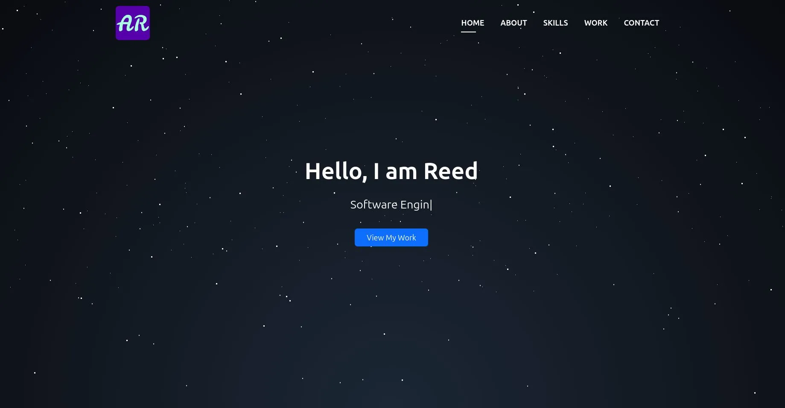
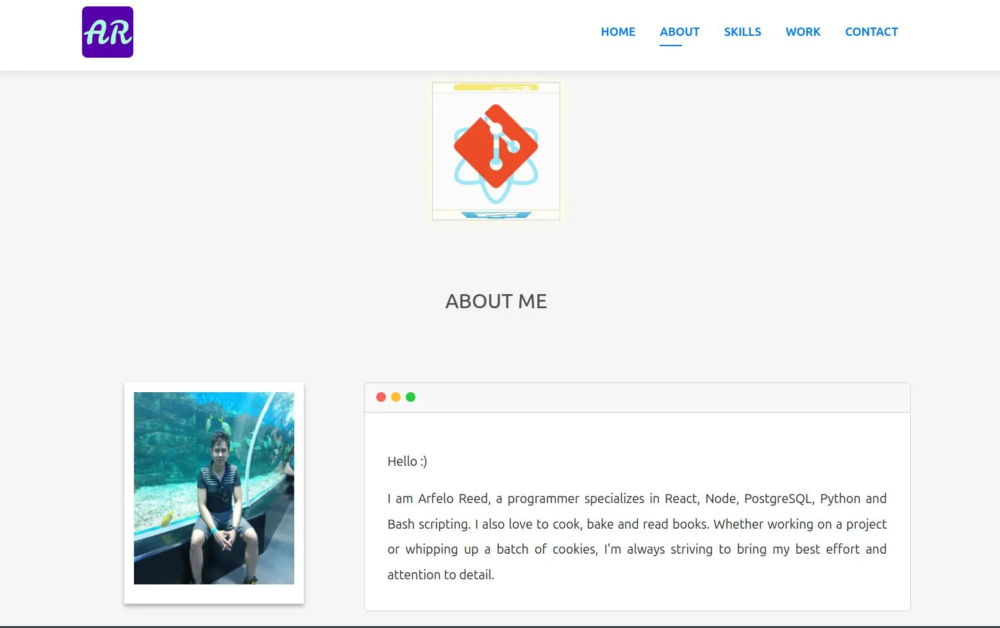
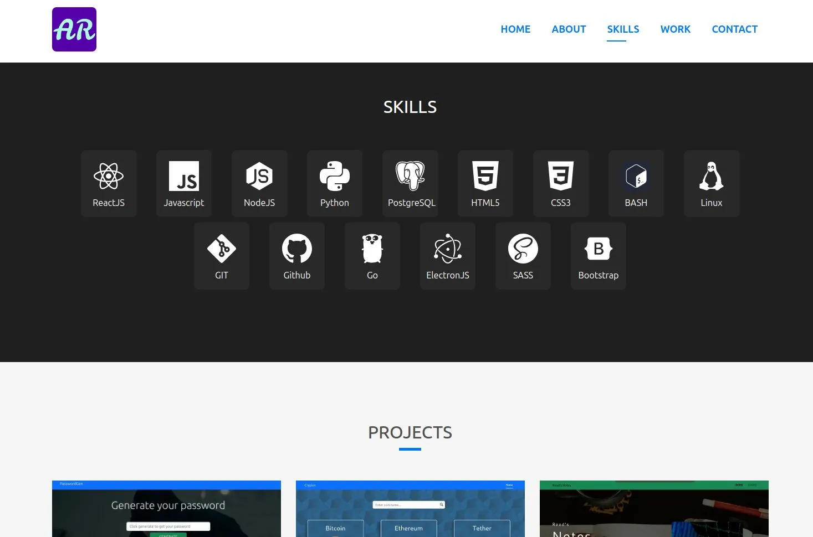
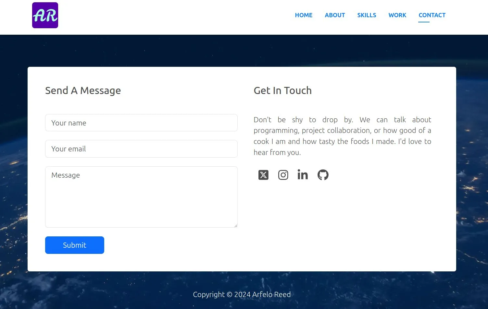

# React Portfolio Template

My personal portfolio made with ReactJs.

_See site live demo @ [arfeloreed.netlify.app](https://arfeloreed.netlify.app/)_

 

 

## How to use?
1. Fork or clone project to you local machine.
2. Run `npm install` to install required dependencies.
3. Run `npm start` and cuztomize accordingly.
4. Deploy on any hosting provider of your choice.